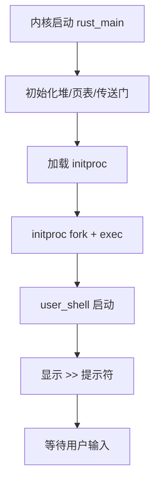

# Ch5: 进程管理

## 核心知识点

- **进程控制块（PCB）**：管理进程所有资源（PID、地址空间、上下文、堆空间）
- **进程创建**：`fork` 复制父进程地址空间创建子进程
- **程序替换**：`exec` 加载新 ELF 替换当前地址空间
- **进程等待**：`wait`/`waitpid` 等待子进程退出并回收资源
- **进程退出**：`exit` 终止当前进程
- **进程树**：通过父子关系形成树状结构
- **initproc**：内核创建的第一个用户进程

## 与 Ch4 的关键区别

| 特性 | Ch4 | Ch5 |
|------|-----|-----|
| 进程创建 | 内核直接从 ELF 加载 | fork/exec 组合创建 |
| 进程关系 | 无父子关系 | 完整的进程树 |
| 资源回收 | 内核直接回收 | wait 系统调用回收 |
| 用户交互 | 无 | Shell 命令行界面 |
| 进程管理 | 简单列表 | ProcManager + 调度器 |
| 物理内存 | 24 MiB | 48 MiB |

## 编译运行

```bash
$ cd ch5
$ cargo build --target riscv64gc-unknown-none-elf
$ qemu-system-riscv64 -machine virt -nographic -bios none \
    -kernel target/riscv64gc-unknown-none-elf/debug/tg-ch5
```

## 运行结果

```
   ______                       __
  / ____/___  ____  _________  / /__
 / /   / __ \/ __ \/ ___/ __ \/ / _ \
/ /___/ /_/ / / / (__  ) /_/ / /  __/
\____/\____/_/ /_/____/\____/_/\___/
====================================
[TRACE] LOG TEST >> Hello, world!
[DEBUG] LOG TEST >> Hello, world!
[ INFO] LOG TEST >> Hello, world!
[ WARN] LOG TEST >> Hello, world!
[ERROR] LOG TEST >> Hello, world!

[ INFO] .text ----> 0x80200000..0x8022b000
[ INFO] .rodata --> 0x8022b000..0x80237000
[ INFO] .data ----> 0x80237000..0x81d77a30
[ INFO] .boot ----> 0x81d78000..0x81d98000
[ INFO] (heap) ---> 0x81d98000..0x83200000

Rust user shell
>>
```

## 运行分析

### 内核内存布局（Ch5 更大）

| 段 | 地址范围 | 大小 |
|----|---------|------|
| .text | 0x80200000..0x8022b000 | 172 KiB |
| .rodata | 0x8022b000..0x80237000 | 48 KiB |
| .data | 0x80237000..0x81d77a30 | ~27 MiB |
| .boot | 0x81d78000..0x81d98000 | 128 KiB |
| heap | 0x81d98000..0x83200000 | ~20.4 MiB |

### 启动流程



### 进程系统调用

```rust
// fork: 复制父进程
fn fork(&self, _caller: Caller) -> isize {
    let child_proc = current.fork().unwrap();
    *context.a_mut(0) = 0;  // 子进程返回 0
    pid.get_usize() as isize // 父进程返回子进程 PID
}

// exec: 加载新程序
fn exec(&self, _caller: Caller, path: usize, count: usize) -> isize {
    // 1. 地址翻译获取程序名
    // 2. 从 APPS 表中查找 ELF
    // 3. 替换当前地址空间
    current.exec(data);
}

// wait: 等待子进程
fn wait(&self, _caller: Caller, pid: isize, exit_code_ptr: usize) -> isize {
    // 从进程管理器获取已退出的子进程
    // 写回退出码到用户空间
}
```

### Shell 工作原理

Shell 是 Ch5 中最重要的用户程序，展示了完整的进程生命周期：

1. Shell 启动后显示 `>>` 提示符
2. 用户输入程序名
3. Shell 调用 `fork()` 创建子进程
4. 子进程调用 `exec(程序名)` 加载并执行目标程序
5. 父进程（Shell）调用 `waitpid()` 等待子进程结束
6. 子进程结束后，Shell 显示下一个 `>>` 提示符

## 组件依赖

- 继承 Ch4 所有组件
- 新增 `tg-task-manage`：进程管理器（ProcManager）、进程ID管理（ProcId）
- 新增 `spin::Lazy`：全局应用名称表的延迟初始化
- 新增 `BTreeMap`：应用名称 → ELF 数据的映射
